  

  
  
  
  
  

---

# 🌐 Top Secure Cloud Web Browser Isolation Ecosystem 🛡️

**Curated List of Commercial SaaS Products, Enterprise Browsers & Open-Source Remote Browser Isolation (RBI) Platforms**

> **Keywords**: Remote Browser Isolation (RBI), Cloud Browser Isolation, Enterprise Browsers, Zero Trust Web Browsing, Web Application Sandboxing, Clientless RBI, Air-Gapped Web Isolation, Malicious Code Execution Prevention, Disposable Containerized Browsing.

---

## 📌 Executive Summary & Industry Overview

Web browsing remains the single largest attack vector for enterprise cyber threats, accounting for over 80% of corporate endpoint infections via zero-day exploits, malvertising, phishing, and drive-by downloads. **Remote Browser Isolation (RBI)** and **Enterprise Managed Browsers** mitigate these vectors by transferring browser session execution from local user devices to isolated remote cloud containers or hardened secure browser layers.

### 📈 Market Size & Industry Concentration
* **Market Size Estimate**: The global Remote Browser Isolation (RBI) market is estimated at **$2.5 Billion in 2026** and is projected to expand to **$4.5+ Billion by 2030**, growing at a Compound Annual Growth Rate (CAGR) of **~25%**.
* **Market Structure & Concentration**: The sector is **moderately concentrated**. It is anchored by major SASE and Zero-Trust network security giants (*Cloudflare, Palo Alto Networks, Zscaler, Broadcom Symantec, Cisco*) alongside high-valuation specialized Enterprise Browser category leaders (*Island, Menlo Security*).

---

## 📋 Table of Contents

- [🏢 SaaS & Hosted Commercial Platforms](#-saas--hosted-commercial-platforms)
- [📦 Open-Source GitHub Projects](#-open-source-github-projects)
- [💡 Architectural Comparison: RBI vs. Enterprise Browser](#-architectural-comparison-rbi-vs-enterprise-browser)
- [🤝 How to Contribute](#-how-to-contribute)
- [💖 Support & Sponsorship](#-support--sponsorship)
- [⚠️ Disclaimer](#%EF%B8%8F-disclaimer)
- [🌟 Star History](#-star-history)

---

## 🏢 SaaS & Hosted Commercial Platforms

Below is a curated summary of commercial Remote Browser Isolation (RBI) and Enterprise Browser solutions, sorted in descending order by **Company Size (Valuation / Annual Revenue / Parent Market Cap)**.

| SaaS Product | Pricing (Starting Tier) | Free Tier / Free Trial Limit | Company Size (Valuation / Revenue) | Core Features & Target Use Case |
| :--- | :--- | :--- | :--- | :--- |
| **[Amazon WorkSpaces Web](https://aws.amazon.com/workspaces/web/)** 🌐 | `$7.00` / user / month *(Includes up to 200 hrs/mo; $0.035/hr overage)* | **30-Day Free Trial** *(Up to 10 users & 20 GB data transfer included)* | **~$2.0 Trillion+** *(AWS / Amazon Market Cap; $100B+ AWS Rev)* | Fully managed, low-cost cloud browser isolation service on AWS infrastructure. Ideal for AWS-centric enterprise BYOD fleets. |
| **[Broadcom Symantec Web Isolation](https://www.broadcom.com/)** 🛡️ | `$3.20` / user / month *(Web Protection Suite add-on tier)* | **30-Day Evaluation License** *(Up to 100 test user seats)* | **~$600 Billion+** *(Broadcom Market Cap; $50B+ Annual Revenue)* | Air-gapped enterprise web isolation with deep DLP integration and file sanitizer for high-security enterprise environments. |
| **[Cisco Secure Browser Isolation](https://www.cisco.com/)** 🔐 | `$4.50` / user / month *(Cisco Secure Access Advantage module)* | **14-Day Free Trial** *(Cisco Umbrella / Secure Access trial for up to 50 users)* | **~$220 Billion+** *(Cisco Market Cap; $54B Annual Revenue)* | Integrated RBI module within Cisco Secure Access SASE stack. Prevents drive-by downloads & phishing attacks across corporate networks. |
| **[Talon Cyber Security (Palo Alto Networks)](https://www.talon-sec.com/)** 🦅 | `$6.00` / user / month *(Prisma SASE / Access integration tier)* | **30-Day Free Trial** *(Managed via Palo Alto Networks Prisma Access portal)* | **~$110 Billion+** *(Palo Alto Networks Market Cap; $8.0B Revenue)* | Enterprise browser built on Chromium with deep DLP, clipboard controls, and screenshot prevention for unmanaged devices. |
| **[Cloudflare Browser Isolation](https://www.cloudflare.com/zero-trust/products/browser-isolation/)** ⚡ | `$7.00` / user / month *(Zero Trust Pay-as-you-go add-on)* | **50 Free Seats** *(Cloudflare Zero Trust core free tier; RBI module on paid trial)* | **~$30 Billion+** *(Cloudflare Market Cap; $1.7B Annual Revenue)* | Clientless Vector-Rendering RBI integrated into Cloudflare's global edge network (<50ms latency globally). High performance streaming. |
| **[Zscaler Cloud Browser Isolation](https://www.zscaler.com/)** ☁️ | `$15.00` / user / month *(ZIA/ZPA Bundle with RBI add-on)* | **14-Day Guided Interactive Trial** *(Available via Zscaler Zero Trust Exchange portal)* | **~$30 Billion+** *(Zscaler Market Cap; $2.1B Annual Revenue)* | Zero-Trust Exchange browser isolation seamlessly air-gapping web traffic and risky web applications for remote workforces. |
| **[Netskope Cloud Browser Isolation](https://www.netskope.com/)** 🔒 | `$5.00` / user / month *(Netskope One SASE add-on)* | **14-Day Proof-of-Concept (PoC)** *(Custom guided enterprise sandbox environment)* | **~$3.0 Billion** *(Valuation; $500M+ Annual Revenue)* | SASE-native web isolation with real-time threat protection, zero-day threat containment, and cloud DLP rule enforcement. |
| **[Island Enterprise Browser](https://www.island.io/)** 🏝️ | `$7.00` / user / month *($84/user/year base enterprise tier)* | **30-Day PoC Trial** *(Up to 25 seats with full IT admin console access)* | **~$3.0 Billion** *(Valuation; $175M Series C; $50M+ Revenue)* | Market-leading enterprise browser built on Chromium. Replaces traditional VDI with native browser security controls, DLP, and auditability. |
| **[Menlo Security Cloud Isolation](https://www.menlosecurity.com/)** 🛡️ | `$3.75` / user / month *($45/user/year entry package)* | **14-Day Request-Based Test Drive** *(Interactive sandbox demonstration environment)* | **~$800 Million** *(Valuation; $100M+ Series E)* | Pioneer of Adaptive Clientless Remote Browser Isolation (Anonymized Disposable Container Streaming). Eliminates web malware vectors. |
| **[Authentic8 Silo](https://www.authentic8.com/)** 🕵️ | `$20.00` / user / month *($240/user/year Silo Research edition)* | **30-Day Free Trial** *(Up to 5 full user licenses for threat research)* | **~$300 Million** *(Valuation; $60M+ Series C Funding)* | Cloud-isolated virtual browser platform engineered for open-source intelligence (OSINT), threat investigation, and anonymous high-risk browsing. |

---

## 📦 Open-Source GitHub Projects

Open-source solutions empower organizations, security engineers, and home lab administrators to deploy self-hosted remote browser isolation infrastructure and ephemeral containerized browser environments.

Entries below are sorted in **descending order by GitHub Star Count**.

| Repository & Project | GitHub Star Count | License | Tech Stack | Core Highlights & Use Cases |
| :--- | :--- | :--- | :--- | :--- |
| **[m1k1o/neko](https://github.com/m1k1o/neko)** 🐱 |  | Apache-2.0 | Go, WebRTC, Docker | **Self-hosted virtual browser running in Docker with WebRTC streaming**. Enables multi-user collaborative browser isolation, virtual room sharing, and interactive sandboxed browsing. |
| **[browserless/browserless](https://github.com/browserless/browserless)** ⚡ |  | SSPL-1.0 | Node.js, Puppeteer, Docker | **Headless Chrome remote browser automation & isolation server**. Runs isolated containerized browser sessions via WebSocket/CDP with resource caps and session management. |
| **[BrowserBox/BrowserBox](https://github.com/BrowserBox/BrowserBox)** 📦 |  | AGPL-3.0 | Node.js, HTML5, LXC | **De facto open-source Remote Browser Isolation (RBI) platform**. Features 60 FPS visual streaming, zero-trust web rendering, document sanitization gateway, passkey auth, and `<browserbox-webview>` embedding API. |
| **[aerokube/selenoid](https://github.com/aerokube/selenoid)** 🐳 |  | Apache-2.0 | Go, Docker | **Lightweight containerized browser execution server**. Launches ephemeral Chrome/Firefox browser instances inside isolated Docker containers with live VNC video streaming and session logging. |
| **[intoli/remote-browser](https://github.com/intoli/remote-browser)** 🔧 |  | BSD-3-Clause | JavaScript, Web Extensions | Low-level browser automation & remote session orchestration framework constructed over WebExtensions API standards for remote rendering controls. |
| **[webrecorder/pywb](https://github.com/webrecorder/pywb)** 📜 |  | MIT | Python, Web Archives | Web archiving engine & isolated replay system. Runs high-fidelity web sessions in isolated sandboxes for digital forensics and threat archive inspection. |
| **[iridium-browser/iridium-browser](https://github.com/iridium-browser/iridium-browser)** 🛡️ |  | BSD-3-Clause | C++, Chromium | **Privacy-hardened Chromium browser build**. Prevents unauthorized telemetry transmission to central servers; ideal endpoint hardened browser alternative for corporate environments. |
| **[ECS-251-W2020/garnet](https://github.com/ECS-251-W2020/garnet)** 💎 |  | MIT | WebAssembly, Rust | Experimental browser isolation research prototype that records remote browser vector drawing instructions and replays them via WebAssembly locally. |
| **[browsersec/KubeBrowse](https://github.com/browsersec/KubeBrowse)** ☸️ |  | Apache-2.0 | Kubernetes, Helm, Go | **Kubernetes-native browser isolation platform**. Runs per-pod ephemeral sandboxed browser sessions with Istio mTLS ingress, automatic threat analysis, and Chrome extension launcher support. |
| **[giriaryan694-a11y/QuantumSurf](https://github.com/giriaryan694-a11y/QuantumSurf)** ⚛️ |  | MIT | Python, Chromium GUI | Lightweight, clientless RBI tool rendering remote web sessions on cloud instances while streaming visual coordinates back to the local client viewer. |
| **[Aeptus/aegiuw](https://github.com/Aeptus/aegiuw)** ⚔️ |  | AGPL-3.0 | Rust | Innovative **edge-based traffic forking RBI**. Evaluates SNI trust decisions; routes trusted traffic directly (<15ms latency) while rendering untrusted sites in disposable cloud browsers. |

---

## 💡 Architectural Comparison: RBI vs. Enterprise Browser

| Architecture Dimension | Remote Browser Isolation (RBI) ☁️ | Enterprise Managed Browser 💻 |
| :--- | :--- | :--- |
| **Execution Location** | External Cloud Container / Remote Virtual Machine | Local Endpoint Device (Hardened Chromium Binary) |
| **Data Rendering** | Vector / Pixel / HTML DOM Stream | Native On-Device GPU & Canvas Rendering |
| **Bandwidth & Latency** | Higher bandwidth consumption; 15–80ms streaming latency | Zero additional network latency; standard web performance |
| **Network Infrastructure** | Requires Cloud Proxy / SASE Gateway | Works offline & directly via standard DNS/TLS |
| **DLP & Threat Prevention** | Air-gapped execution prevents 100% of browser exploits | Policy enforcement (prevents copy-paste, print, download) |
| **Deployment Fit** | Unmanaged BYOD devices, contractor access, high-risk web research | Corporate-owned endpoints replacing traditional VDI |

---

## 🤝 How to Contribute

Contributions are welcome! Help build the definitive index for Secure Cloud Web Browser Isolation technology:

1. **Fork** the repository.
2. Add your commercial product or open-source repo into the respective table.
3. Follow the table column structure (Name, Pricing, Free Tier, Company Size/Stars, Features).
4. Submit a **Pull Request** with a brief summary of the proposed changes.

Check out our full collection of curated lists at [Awesome-Awesome-Awesome](https://github.com/ishandutta2007/Awesome-Awesome-Awesome).

---

## 💖 Support & Sponsorship

If you find this curated list valuable for your security research, infrastructure planning, or enterprise architecture evaluation:

- 🌟 **Star this repository** to show support!
- 🔀 **Fork it** to customize your internal security evaluation matrices.
- 📢 **Share it** with fellow cybersecurity engineers and enterprise architects.
- ☕ **Sponsor the Maintainer**: Support ongoing open-source research and maintenance via [GitHub Sponsors](https://github.com/sponsors/ishandutta2007).

---

## ⚠️ Disclaimer

- This list is **community-curated** for educational, technical evaluation, and research purposes.
- Browser isolation platforms handle sensitive web sessions and authentication credentials. Self-hosted deployments require continuous security updates and hardening.
- Pricing metrics, free trial terms, and financial valuations reflect publicly reported market data as of October 2026 and are subject to change by vendor entities.

---

## 🌟 Star History

